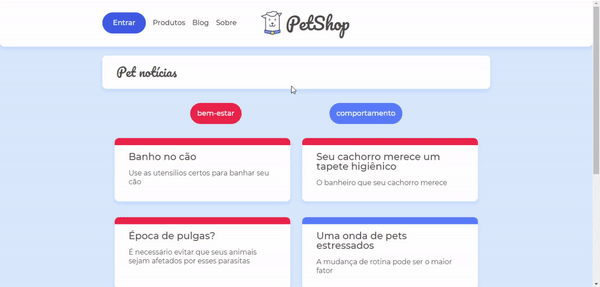

# Petshop

Project created in one of Alura's React courses to learn about navigation in a SPA. <br />

In it I learned: <br />

- How to establish routes to other pages;
- How to leave the application dynamic with requests to the API;
- How to set up filters to search for posts more efficiently.
  
# Overview




# How to run

```
# Clone this repository
$ git clone https://github.com/velleeda/Petshop

# Go to the directory
$ cd Petshop
```
  
```
# Install Dependencies
$ npm install

# Run Web Server
$ npm start

# Run Server
$ npm run server
```
